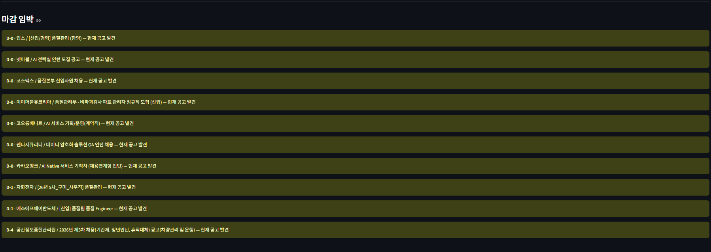
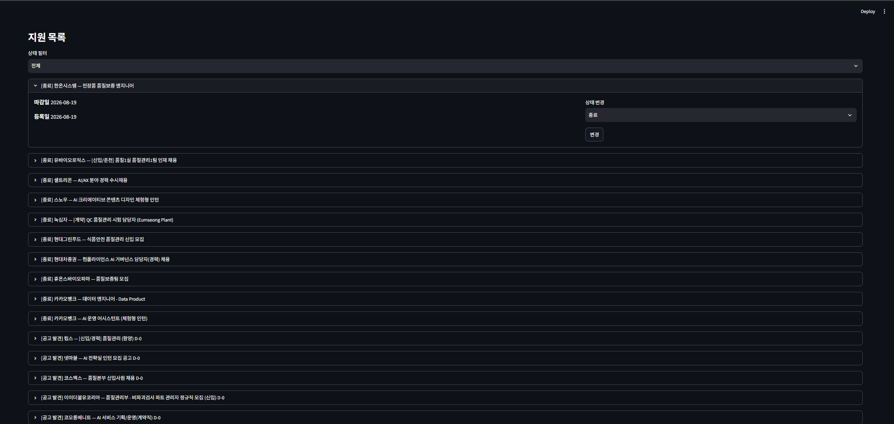
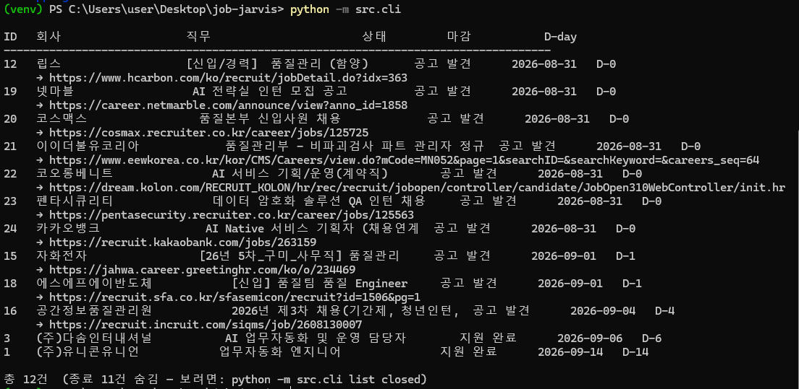
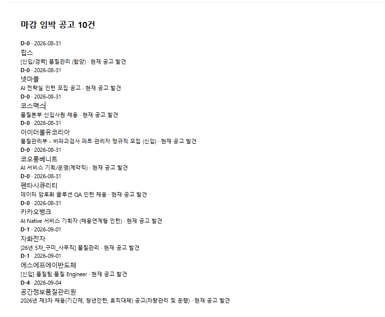

# Job Jarvis

채용공고 파싱부터 자기소개서 초안 생성, 지원 이력 관리까지 자동화하는 AI 에이전트.

## 왜 만들었나

구직 활동에서 반복되는 작업은 세 가지였습니다.

- 공고를 찾아 자격요건을 정리하는 일
- 회사마다 자기소개서를 다시 쓰는 일
- 어디에 지원했고 마감이 언제인지 관리하는 일

이 세 가지를 하나의 파이프라인으로 연결했습니다.

## 주요 기능

- **공고 수집** — 워크넷 공채속보 API로 키워드에 맞는 공고를 자동 수집
- **공고 구조화** — LLM으로 채용공고 원문을 JSON 스키마로 변환
- **자소서 초안 생성** — 경험 원자 DB에서 공고에 맞는 경험을 선별해 초안 작성
- **부족 요건 분석** — 공고가 요구하지만 충족하지 못하는 항목(gaps)을 자동 도출
- **지원 이력 관리** — SQLite 기반 상태 머신으로 지원 단계 추적
- **알림** — 마감 임박·초안 완성 시 메일 발송, 메일 버튼으로 상태 변경
- **대시보드** — Streamlit 기반 현황 조회


## 화면

### 마감 임박 공고

수집된 공고 중 아직 지원하지 않은 건을 D-day 순으로 보여준다.
마감이 지난 건은 자동으로 종료 처리되어 목록에서 빠진다.



### 지원 목록과 상태 관리

항목을 펼치면 마감일, 등록일, 충족하지 못한 요구사항(gaps)을 확인하고
지원 단계를 바로 변경할 수 있다.



### 터미널 조회

공고 목록과 D-day, 원문 링크를 한 화면에서 확인한다.
종료된 건은 기본으로 숨기고, 필요할 때만 조회한다.



### 자동 알림

매일 아침 새 공고를 수집하고, 마감이 임박한 미지원 공고를 메일로 알린다.



## 설계 판단

**Human-in-the-loop**
제출은 자동화하지 않았습니다. AI가 초안을 만들고 사람이 검토·승인하는 구조입니다.
채용 플랫폼 약관 문제도 있지만, 검증되지 않은 문서가 그대로 나가는 것을 막기 위해서입니다.

**할루시네이션 구조적 차단**
이력서를 통째로 넣는 대신 경험을 원자 단위 JSON으로 관리하고,
"이 안의 사실만 사용하라"고 제약했습니다. 프롬프트로 부탁하는 대신 재료 자체를 제한한 방식입니다.

**프롬프트가 아니라 코드로 강제**
스키마 외 필드 제거, 회사명 누락 시 중단, DB의 UNIQUE 제약 등
지켜져야 하는 규칙은 LLM에 맡기지 않고 코드로 검증합니다.

**계층 분리**
수집(reader) · 구조화(parser) · 생성(draft) · 저장(db)을 분리해
입력 경로가 바뀌어도 뒷단을 재사용할 수 있게 했습니다.

## 파이프라인

```
공고 텍스트 → 구조화 JSON → 경험 매칭 → 자소서 초안 + gaps
                                ↓
                   SQLite 상태 기록 → 메일 알림 → 승인 → 상태 갱신
```
## 기술 스택

Python · Claude API · SQLite · FastAPI · Streamlit · 워크넷 OpenAPI

## 문서

- [사용법](docs/USAGE.md)
- [구조 및 설계](docs/ARCHITECTURE.md)
- [설치](docs/SETUP.md)